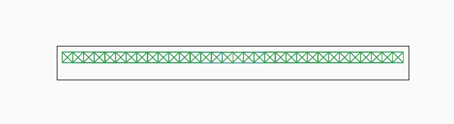
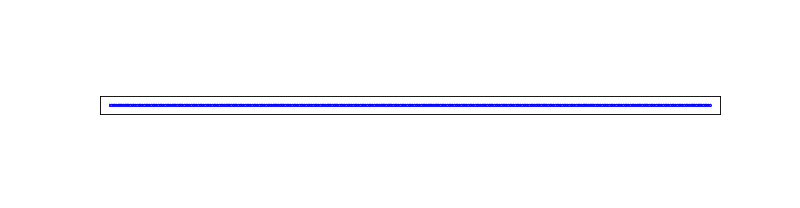
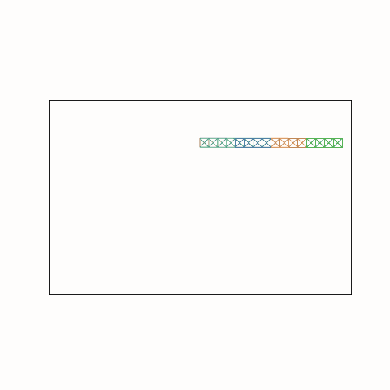
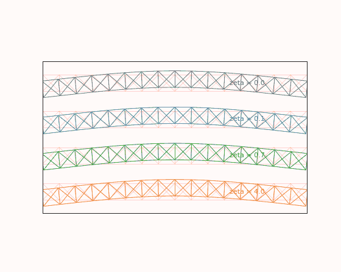

# Modal XPBD (MXPBD)
This is a minimal demonstration of the concept of constrained  rigid body dynamics 
enriched with modal flexibility, implemented in JAX, in 2d for simplicity.

The motivation is that the most commonly modelled systems are 
neither ideal rigid bodies, nor jello, but for improved realism require the 
modelling of small flex that can be crucial to the true dynamics of relevant systems.
Iterative flexible body solvers are in practice limited to materials considerably
more compliant than those of engineering interest — what converges acceptably
tends toward jello — leaving the stiff but flexible regime poorly served.

However, irreduced flexible simulation is usually infeasible, for performance
reasons or numerical stability. Nor can we always model flex through joint compliance; a robot arm is typically orders of 
magnitude more compliant in torsion than it is axially, for instance.

Constraints are solved XPBD-style, by projecting degrees of freedom onto the
constraint manifold in a least-action sense. 

Hence we name this MXPBD; where the X extends PBD with rotational rigid body DOFs,
the M extends the rigid body DOFs with modal DOFs

## Examples

The bridge below consists of girders of just a few modal bodies each. If we were to simulate all its elements directly,
a geometry of this aspect ratio would be an extremely stiff system, requiring a lot of 
compute to timestep. But the small number of modal bodies are well conditioned,
and easily solved with a quasi-explicit PBD style update mechanism.

The same bridge at three stiffness levels; solved with the same efficiency using efficient local updates
(`stiffness_sweep.py`):



A thin (256x1) yet very stiff clamped beam, crushed by a prescribed end displacement, pops as it crosses its euler
load (`buckling.py`):



A chain of flexible girders whips through full rotations, demonstrating large angle displacements together with various levels of compliance; zero compliance at the top, but noticeable compliance at the bottom;
anything in between will work together efficiently.
(`swinging_chain.py`):



The same girder bent and released, at damping ratios spanning undamped to overdamped
creep, all at one and the same timestep, each trace on the analytic damped oscillator
(`damping_sweep.py`):



## Key ideas

**Modal stiffness as XPBD compliance.** Each mode contributes one elastic constraint
whose value is simply its amplitude, with compliance `1 / omega**2`. This is the XPBD
treatment of stiff potentials: arbitrarily stiff modes are unconditionally stable, and
the formulation degrades gracefully to a rigid body as `omega -> inf`. Explicit
integration of modal forces would instead demand `dt < 2 / omega_max`.

** Point constraints can be solved in a blockwise fashion.** On a flexible body there
is no such thing as a lumped joint: a hinge line or weld frame is ill-defined on a
deforming body. Yet to counter geometric stiffness point constraints need to be solvable 
in a block fashion rather than relaxed one at a time. 
(girders in the above example are joined by point-pairs solved simultaneously)

**Modes only add low overhead.** Solving a group of constraints (point reactions, modal
reactions) has a diagonal modal block, eliminated analytically: the point constraints
see each mode as a scalar mobility `alpha / (1 + alpha)`, interpolating between mass
limited (soft modes) and immobile (the rigid limit). The dense solve is over the joint
reactions only, assembled over constraint-body incidences: a modal body has the same
time complexity as a rigid body in the solve, regardless of its number of modes.
Contrast with FEM, where every flex DOF lands in the global system,
and adds a super-linear cost to the solve.

**High frequency unresolved modes are low-passed, not unstable.** Per mode, a substep of the
projection acts as implicit euler: the amplitude contracts by exactly
`1 / sqrt(1 + (omega h)**2)` per substep. Modes far above the substep rate are thus
damped away within a few substeps rather than aliasing, while their static compliance
is exactly preserved: the settled deflection under load is independent of the timestep
(`test_dynamics.py::test_unresolved_modes` asserts both). The spectrum divides at
`omega h ~ 1`: the damping ratio governs the modes the timestep resolves, the numerical
dissipation governs the ones it does not, and quasi-static load transfer through stiff
modes is retained either way. Keeping stiffness costs nothing; only dynamics cost timestep.

**Damping is part of the model.** Real structures are characterized by per-mode
damping ratios — and that measured quantity is exactly the model input here. Each
dashpot `2 zeta omega` is discretized implicitly and folded into its mode's constraint
(see `solve.modal_terms`), so arbitrarily strong damping costs nothing: no numerical
stiffness as it would in direct FEM, no timestep limit, and static equilibria are
exactly untouched. Contrast pure rigid body PBD, where there is no internal motion to
damp, and damping typically takes the form of ad hoc velocity terms, motivated by
solver stability rather than by the material being modelled. Note also that modal damping acts on the flex alone: rigid frame motion
coasts undamped — visible in the swinging chain, whose energy decays
in bursts where the whip excites flex, and holds level through the smooth swing phases.

## Layout

- `truss.py` — 2d truss construction and assembly (numpy; offline)
- `decompose.py` — modal reduction: free-free eigenmodes, mass-orthonormalized
- `body.py` — rigid (se2) + modal body state; constant diagonal mass matrix
- `constraint.py` — point constraints and their jacobians
- `solve.py` — the XPBD projection and timestepper
- `block.py` — block matrix operations; see its docstring for the flattening invariant
- `examples/girder_bridge.py` — girders joined by splice pairs, sagging under gravity
- `examples/stiffness_sweep.py` — the same bridge at three stiffness levels, one exactly
  rigid; deflection and period scale with compliance
- `examples/free_vibration.py` — a kicked free floating body rings at its eigenfrequencies
- `examples/damping_sweep.py` — the girder bent and released at damping ratios from
  undamped to overdamped creep; one timestep for all, every trace on the analytic
  damped oscillator
- `examples/buckling.py` — a clamped beam, rigid against gravity, pops as a prescribed
  end displacement crosses its euler load; geometric nonlinearity a single linearized
  body cannot express
- `examples/swinging_chain.py` — girders hinged by single pins whip through full
  rotations; the large angle regime, with the energy trace as its correctness exhibit.
  The links grade from exactly rigid at the pin to soft at the tip: per-body
  compliance in one assembly, through one solve

## Validation

`test/test_dynamics.py::test_cantilever_sag_matches_fem` settles a world-pinned girder
under gravity and compares against the full-order FEM solution: with the complete
flexible basis the error is under 1%. With a truncated basis the error decays slowly
in mode count: clamped-end deflection projects weakly onto free vibration modes.

The known fix is component mode synthesis: augment a few eigenmodes with *static
correction modes* (deflection shapes under unit loads at the anchors), re-orthogonalized
against mass and stiffness so the modal blocks stay diagonal. Not yet implemented; the
decompose pipeline has everything needed.

`test_dynamics.py::test_bridge_matches_nonlinear_fem` validates the assembly level:
a girder chain supported at its bottom corners softens geometrically (end rotation about
the eccentric supports feeds axial compression into the sagging span — the beam-column
effect; supports at the top corners stiffen instead). At the deflection tested, the
*linear* full-order solution errs by roughly half, while the chain of strictly linear
modal bodies tracks the geometrically exact equilibrium (`truss.solve_static_nonlinear`)
to within its modal truncation bias: the large rotations live in the floating frames,
so geometric nonlinearity is recovered at the resolution of the body subdivision.

## Limitations

- Inertial coupling between body rotation and modal rates is neglected; valid when
  rotation rates are slow relative to the modal frequencies.
- The constant diagonal inertia is evaluated at the undeformed configuration.

## Running

```bash
conda env create -f environment.yml
conda activate modal_xpbd

pytest modal_xpbd/test/
python -m modal_xpbd.examples.girder_bridge
```

## The math

Body state is a pose $(\theta, x) \in SE(2)$ plus modal amplitudes $q \in \mathbb{R}^k$;
a material point at rest position $\bar v$ sits at $p = R(\theta) (\bar v + \Phi q) + x$.
With the body origin at the center of mass and the mode shapes $\Phi$ mass-orthonormal,
the mass matrix in $(\dot\theta, \dot x, \dot q)$ is the constant diagonal
$M = \mathrm{diag}(I, m, m, 1, \dots, 1)$.

Each substep $h$ integrates the unconstrained dofs forward, then projects the positions
back onto the constraint manifold in the mass-weighted least squares sense. Two kinds of
constraints share the projection: point constraints $C_p$ (anchor coincidence between two
bodies; attachment to the world is a pin to a world body of zero inverse mass, through
the same code path), and one elastic constraint per mode, $C_m = q$ with compliance
$\alpha = 1/\omega^2$ — the XPBD treatment of the elastic potential
$\tfrac{1}{2} \omega^2 q^2$. The XPBD update for constraints with jacobian $J$ and
$\tilde\alpha = \alpha / h^2$ solves

$$(J M^{-1} J^T + \tilde\alpha)\ \Delta\lambda = -C - \tilde\alpha \lambda,
\qquad \Delta s = M^{-1} J^T \Delta\lambda$$

with $\lambda$ accumulated across the substep's gauss-seidel passes, so overlapping
relaxations of the same constraint combine consistently regardless of grouping or ordering.

A group of point constraints can be solved as one block, coupled with the modal constraints
of the bodies it touches; since solving single point constraints in isolation can be ill conditioned. 
With unit modal mass the modal block is the diagonal $1 + \tilde\alpha_m$, and is
eliminated analytically from the linear system solve via Schur complement. Hence, the size of the linear system that needs solving for each constraint is not affected by the number of modes, and the linear solves remain tiny (max 4x4 in these 2d point pair examples)

All that remains of an eliminated mode in the point system is a scalar effective
inverse mass, its mobility

$$W = \frac{\tilde\alpha_m}{1 + \tilde\alpha_m}$$

weighting its jacobian in the Schur complement exactly as $M_b^{-1}$ weights the rigid
jacobians:

$$S = J_b M_b^{-1} J_b^T + J_q W J_q^T + \tilde\alpha_p$$

A soft mode ($\tilde\alpha_m \to \infty$, $W \to 1$) yields to the point reactions with
its full inverse modal mass, resisting through inertia alone; a stiff mode
($\tilde\alpha_m \to 0$, $W \to 0$) does not yield at all, which is the rigid limit.

Per mode the projection acts as implicit euler: the free amplitude contracts by exactly
$1/\sqrt{1 + (\omega h)^2}$ per substep, which is the low-pass behavior of the unresolved
spectrum. Prescribed damping is a per-mode dashpot $2 \zeta \omega$, discretized
implicitly and folded into the constraint as scalings $1 / (1 + g)$ with
$g = 2\zeta / (\omega h)$, leaving static equilibria untouched. Velocities are recovered
from the realized positions, $v = (s - s_{\mathrm{prev}}) / h$, which is what makes
substepping stable.
